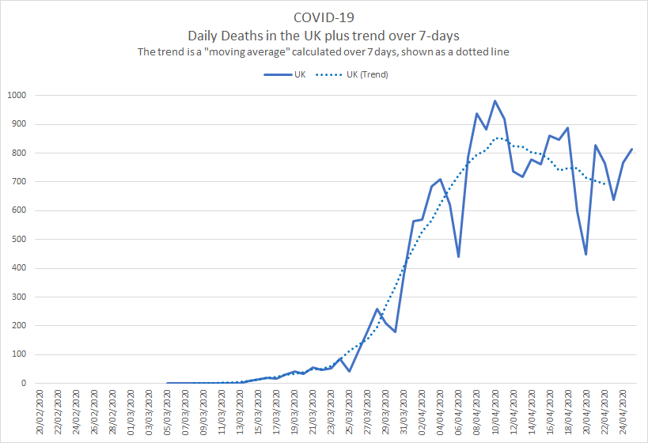
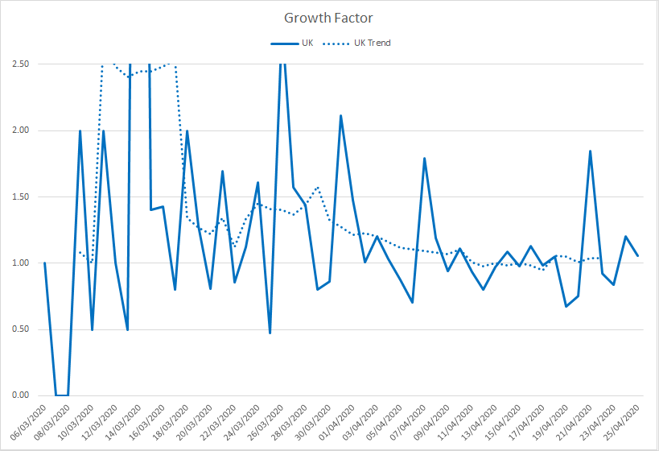

# COVID-19

## UK Trends and Observations

Author: Michael George

Date Created: 21 April 2020

### Introduction

Let me begin this article by stating that I am not an epidemiologist and that I'm a software engineer who has been something of a data geek for around 25 years. I worked in data warehousing and related reporting in the 90's, data engineering and analytics since the turn of the millennium and focused on data science projects in recent years.

Since mid-February, I have acquired an interest in the data and developments relating to SARS-COV-2 (virus) and COVID-19 (disease). Early in March it became apparent that COVID-19 was going to have a huge impact in the UK (and the rest of the world) so since the second week of March, I've been tracking the progress of COVID-19 across Europe, especially in the UK.

In early March the UK experts were saying that we were probably around two weeks behind Italy but there were still a fair number of sceptics amongst the wider UK population and some people still remain sceptical today. I've been tracking the disease for about 6 weeks now and found some of my charts pretty interesting so I've decided to share them more widely.

There are plenty of good lectures and resources on the internet, describing the nature of epidemics; how they progress and how they can be controlled. The main point of note is that early in any epidemic the growth is expected to be near exponential (without mitigation) and the two variables that best describe the growth in the number of cases and resultant deaths are the R0 (reproduction number) and the doubling rate. When the number of people (without immunity) being exposed to the disease reduces sufficiently then so does the number of new cases and ultimately the number of daily deaths.

### Analysis of Daily Deaths

It quickly became apparent that COVID-19 testing varies considerably in different countries around the world which makes direct comparisons pretty complex. What is somewhat easier to compare is total number of deaths reported in each country and in particular the number of daily deaths.

Although the number of daily deaths is captured and reported differently around the world as whole there are parallels between the reporting of deaths in Italy, Spain and the UK. For example, daily death reports in Italy and the UK are almost exclusively for hospital deaths and typically exclude nursing homes and the wider community.

Italy, Spain and the UK have similar population sizes; Italy is 60.4 million, Spain is 46.9 million and UK is 66.7 million. Despite Italy having an "older" population than the UK the median ages are not entirely dissimilar; Italy is 45.4, Spain is 44.9, UK is 40.0. It is also worth noting that the median age of ICU patients in the UK is 60 years old and that 25% of ICU patients are under 52 years old. Many of the ICU patients in the UK are actually in their 40s †.

As you will see by the graphs later in this article there is a striking similarity between the epidemics in Italy, Spain and the UK.

† Median and IQR of ICU patients from [ICNARC](https://www.icnarc.org/Our-Audit/Audits/Cmp/Reports) report 2020-04-17

#### UK Hospital Deaths

The daily deaths that are reported by the UK media (plus sites such as [Worldometer](https://www.worldometers.info/coronavirus/) and [John Hopkins](https://coronavirus.jhu.edu/map.html)) are almost exclusively the hospital deaths of patients who have tested positive for COVID-19.

There can be a lag of several days (sometimes over a week) between a COVID-19 death and it being included in the official daily figures. The UK figures announced on Sundays (up to 5pm on Saturday) and Mondays (up to 5pm on Sunday) are always low because of delays in the weekend reporting.

These delays cause significant spikes and dips in the daily figures as shown in the graph below but a 7-day [moving average](https://en.wikipedia.org/wiki/Moving_average) gives a much better idea of what is actually happening in terms of an overall trend; see dotted line.

Showing the trend as a moving average smooths out the daily fluctuations, making comparisons across different countries, demographics or time periods somewhat easier. Most of the graphs in this article use moving averages to increase clarity.

#### European Comparison

When comparisons are made by scientists or by the media you will often see that the start point is defined as the day that each country has recorded a certain number of total deaths. The UK government briefings tend to use 50 deaths and other scientists and news sources sometimes use 100 or 1000 deaths.

When comparing the data for Italy, Spain and the UK, I originally aligned the three countries based on when they each passed 100 total deaths. Since all three countries have now passed their initial peak it is possible to align the countries based on the day that they each passed 10,000 total deaths.

The unfiltered comparison of Italy, Spain and the UK shows a striking similarity between the three countries †.

The graph is rather "noisy" due to the peaks and troughs which is largely down to reporting delays (discussed earlier).

Showing the Italy, Spain and UK trends using a 7 day moving average makes the graph a lot clearer and trends easier to interpret:

")

I am not going to speculate the whys and wherefores of the similarities between the three countries but it is worth noting that the "peaks" are much lower than they would have otherwise been without any lockdown measures. The first few weeks for all three countries exhibited exponential growth which has subsequently been supressed by the lockdown measures, reducing the spread of the virus.

It is worth noting that the "way back down" is slower than the "way up". The lockdowns essentially buy time for scientific research and vaccine development whilst the burdens on health systems such as the NHS are reduced to the point where the overall capacity is not exceeded.

† The number of daily deaths for Italy, Spain and the UK have been taken from the [Worldometer](https://www.worldometers.info/coronavirus/) website.

#### UK Deaths in Hospitals and Communities

The daily figures announced in the mainstream media and the associated trends are only the deaths recorded in UK hospitals.

The [Office for National Statistics](https://www.ons.gov.uk/) (ONS) publishes weekly statistics for all deaths in England and Wales. These statistics have always included the number of deaths due to respiratory diseases (which includes seasonal flu and viral pneumonia) but since the start of this year they have also included the number of weekly deaths where COVID-19 was mentioned on the death certificate.

Just like the daily death statistics the weekly ONS statistics also suffer from reporting delays and show large fluctuations (especially around Christmas) so it is helpful to show the trends using a moving average.

The legend on the graph below explains what the lines are but it essentially compares the last 5 years; all deaths, respiratory related deaths and COVID-19 related deaths. The graph starts at the beginning of the seasonal flu season (early October) and the nature of a typical flu seasonal can be clearly be seen both in total deaths and respiratory related deaths.

What is most striking in the graph above is the impact of COVID-19 since late-March 2020. This can clearly be seen in both the total number of deaths and the number of deaths where COVID-19 is mentioned on the death certificate. It is worth noting that the mention of COVID-19 on a death certificate may be due to a positive test result (whilst in hospital) or clinical diagnosis (e.g. suspicion of a doctor, based on clinical symptoms) but this is no different to how the total number of seasonal flu deaths is recorded.

There is a two-three week lag before deaths appear in the ONS data so the graph above (dated 10 April 2020) is only just starting to show the effects of the UK lockdown.  It is quite clear that the early impact of COVID-19 on the UK population and the NHS is far from "normal" and without the UK lockdown it would have almost certainly continued to grow exponentially.

Source: [Deaths registered weekly in England and Wales](https://www.ons.gov.uk/peoplepopulationandcommunity/birthsdeathsandmarriages/deaths/datasets/weeklyprovisionalfiguresondeathsregisteredinenglandandwales) (ONS)

#### UK Growth Factor

One of the simplest ways to monitor the spread of COVID-19 and whether figures are growing exponentially is to look at the growth factor. To save myself some typing here is a copy / paste from [Worldometer](https://www.worldometers.info/coronavirus/coronavirus-death-toll/):

> Growth factor is the factor by which a quantity multiplies itself over time. The formula used is every day's new deaths / new deaths on the previous day. For example, a quantity growing by 7% every period (in this case daily) has a growth factor of 1.07.
>
> A growth factor above 1 indicates an increase, whereas one between 0 and 1 it is a sign of decline, with the quantity eventually becoming zero.
>
> A growth factor below 1 (or above 1 but trending downward) is a positive sign, whereas a growth factor constantly above 1 is the sign of exponential growth.

It can be seen that about two to three weeks after the introduction of social distancing (16 March 2020) and after one or two weeks of enforced lockdown in the UK (23 March 2020), exponential growth has been supressed and the number of daily deaths is now starting to steadily decline.

#### What Next?

The graphs in this article have all been created from publicly available data and statistics but illustrated and explained in a way that you may not have seen before now. What happens over coming weeks and months is yet to be seen and there is clearly no simple solution to the COVID-19 issue.

One thing for sure is that the current restrictions cannot be suddenly removed in their entirety or exponential growth will return and we'll see a second spike (potentially worse in the number of cases, ultimately leading to many more deaths. There is no health system on the planet that has enough spare capacity to cope with exponential growth of COVID-19 patients, hence the government mantra; "stay at home, protect the NHS, save lives".

The best analogy that I've heard is that we've jumped out of a plane and deployed a parachute which has now slowed down our descent. We still have quite some time until we land safely, so now is not the time to decide that the parachute has done it's job and take it off.

##### Herd Immunity / Vaccine?

The so called "[herd immunity](https://en.wikipedia.org/wiki/Herd_immunity)" for COVID-19 is ultimately what we need in the medium and long term but how it is acquired is not nearly so clear cut as "protect the vulnerable but let the young and fit catch it to develop natural immunity".

I'll refrain from writing too much on this topic but it should be made clear that there are a lot of unknowns when it comes to COVID-19 (the disease) and any immunity developed through being infected by SARS-COV-2 (the virus). It is already known that naturally developed immunity doesn't last long for other coronaviruses (SARS, MERS, common colds) so allowing vast swathes of the population to become infected is a very risky strategy, would likely cost hundreds of thousands of lives in the UK and it may not even be successful in the medium to long term.

It should also be noted that despite numerous discussions in the mainstream media (and social media) dating back to March, herd immunity is not the UK government policy nor indeed their plan. Early modelling of the COVID-19 epidemic was based on prior modelling and assumptions for a major influenza epidemic with a much lower mortality rate than COVID-19. When the Imperial College models were updated to use the latest hospital data coming out of China and Italy it quickly became clear that any "herd immunity" plan would be catastrophic for the NHS and would have a devastating human cost †. One week later the UK was in the current lockdown.

The good news is that there are hundreds of expert teams around the world, working on the creation of a vaccine that is both effective and safe for the general population. A human created vaccine has the additional benefit that it can be synthesised to provide longer term immunity than any naturally developed immunity acquired by survivors of COVID-19. All coronaviruses will mutate over time (just as all other types of virus mutate) but generally speaking coronaviruses mutate more slowly than other virus families such as influenza. The experts are pretty optimistic that an effective vaccine can be developed for COVID-19 but it will take some time to do the clinical trials, prior to vaccinating the majority of the population.

What is clear is that life will be quite different for many months to come but there are several reasons to be optimistic about the future.

Stay at home, protect the NHS, save lives.

† [Report 9 - Impact of non-pharmaceutical interventions (NPIs) to reduce COVID-19 mortality and healthcare demand](https://www.imperial.ac.uk/mrc-global-infectious-disease-analysis/covid-19/report-9-impact-of-npis-on-covid-19/)