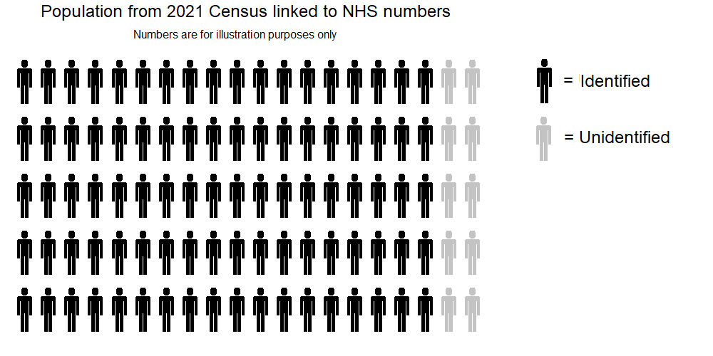
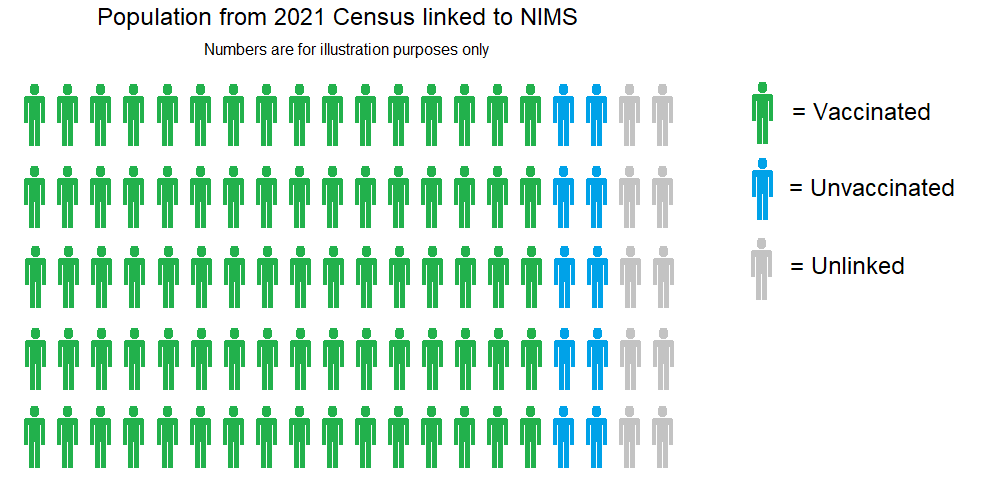
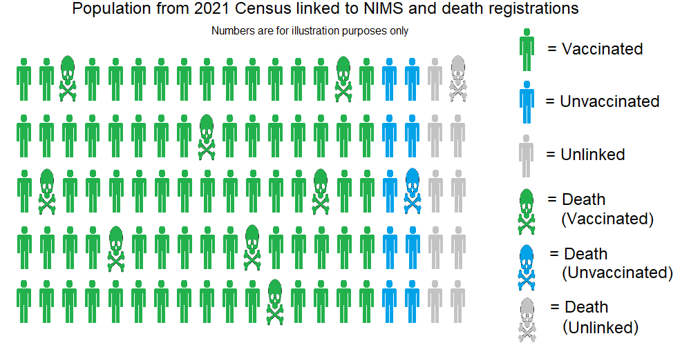

## Deaths Involving COVID-19 by Vaccination Status, England - ETL overview

Author: Michael George
Created: 25 February 2023

### Introduction

The deaths by vaccination status [dataset](https://www.ons.gov.uk/peoplepopulationandcommunity/birthsdeathsandmarriages/deaths/datasets/deathsbyvaccinationstatusengland) from the ONS has caused a great deal of interest amongst people studying official data relating to the recent pandemic, vaccinations, and excess mortality. On 21 Feb 2023 the ONS published the first updates since mid-2021, making use of the 2021 census data.

The [ETL](https://en.wikipedia.org/wiki/Extract,_transform,_load) processes for the deaths by vaccination status dataset is clearly described in an associated [bulletin](https://www.ons.gov.uk/peoplepopulationandcommunity/birthsdeathsandmarriages/deaths/bulletins/deathsinvolvingcovid19byvaccinationstatusengland/latest).

The overall ETL process has been clearly summarised by the ONS but widespread misunderstandings seem to persist about how the dataset has been created, what it really represents and the significance (or not) of population estimates, especially for the unvaccinated.

Since I have a pretty extensive background in similar types of data processing, I've decided to share my interpretation of the ETL process in layman terms. This explanation will be based on my own understanding of the ONS bulletin and my personal ETL experiences in related matters.

### Background

It is perhaps worth summarizing my own background to explain why I have taken such an interest in the ETL process of this dataset. I have no affiliation with the [ONS](https://www.ons.gov.uk/), [UKHSA](https://www.gov.uk/government/organisations/uk-health-security-agency) or the [NHS](https://www.nhs.uk/). I'm completely independent but the descriptions in their bulletins are very clear. 

During my career, I've spent in excess of 15 years designing and developing data systems in a number of industries and sectors. These systems all process high volumes of personally identifiable information ([PII](https://en.wikipedia.org/wiki/Personal_data)), primarily for subsequent [analytics](https://en.wikipedia.org/wiki/Analytics) and [predictive modelling](https://en.wikipedia.org/wiki/Predictive_modelling).

For more than 8 years, I was the architect and lead developer of an open market software + data product to automatically link and de-duplicate high volumes of personal data. This particular product supports [batch](https://en.wikipedia.org/wiki/Batch_processing) and [real-time](https://en.wikipedia.org/wiki/Real-time_computing) processing and is still on the market today, typically for large companies.

Intelligently matching datasets using names and addresses is the bread and butter of many systems handling personal data. I spent many years developing and tweaking the matching algorithms for this very purpose, so I am intimately familiar with the finer details and the many nuances.

Now that's out of the way, let's to a quick summary of the 2021 census and NIMS before looking at the ETL process for deaths by vaccination status.

### Census 2021

The ONS [population estimates](https://www.ons.gov.uk/peoplepopulationandcommunity/populationandmigration/populationestimates/bulletins/populationandhouseholdestimatesenglandandwales/census2021unroundeddata) from the 2021 census are the best possible understanding that we can have of individuals and households in England. These estimates even account for the non-responses which may be a surprise to some people.

The overall person [response rate](https://www.ons.gov.uk/peoplepopulationandcommunity/populationandmigration/populationestimates/bulletins/populationandhouseholdestimatesenglandandwales/census2021unroundeddata#measuring-the-data) of the 2021 census was 97%, and no individual local authorities had less than an 88% response rate. These response rates exceeded the targets of 94% and 80% respectively.  

Non-responses and inconsistencies are resolved by an elaborate statistical process of editing and [imputation](https://en.wikipedia.org/wiki/Imputation_(statistics)). The editing and imputation processes are well described in the associated [methodology](https://www.ons.gov.uk/peoplepopulationandcommunity/populationandmigration/populationestimates/methodologies/itemeditingandimputationprocessforcensus2021englandandwales#item-non-response-edit-failure-and-imputation-rates) document.

The final output of the census says the resident population in England was about 56.5 million. Approximately 53.4 million of these were aged 5 or over, and around 44.7 million were aged 18 or over.

The accuracy of the population estimate for the day of the census have been determined to be within 0.5% of the true figure, using a standard 95% confidence interval.

 

### National Immunisation Management System (NIMS)

[NIMS](https://www.graphnethealth.com/solutions/vaccinations/) is the IT software provided by the System C & Graphnet Care Alliance that supports the management of the influenza and Covid-19 vaccination programmes across England. It has been delivered in partnership with [NHS South Central & West CSU](https://www.scwcsu.nhs.uk/).

This system is not only used by the NHS for managing the COVID-19 and Influenza vaccination programmes in England but it is also used by the UKHSA for their [vaccination surveillance](https://www.gov.uk/government/publications/covid-19-vaccine-weekly-surveillance-reports) reports and also for the COVID-19 [dashboard](https://coronavirus.data.gov.uk/details/vaccinations).

I have been informed that NIMS acquires personal data from England's Primary Care Registration Management service database. This includes the latest data from GP practices and NHS trusts but it is known to contain large numbers of "phantom" persons.

The NIMS currently reports around 61.2 million persons aged 5 or over in England, and around 51.6 million aged 18 or over. These figures are much higher than the ONS population estimates; around 7.6 million (14%) and 6.8 million (15%) respectively.

No matter what you may believe, or how you try to prove it, counting persons in NIMS is not useful for estimating the population size of England. I plan to do a follow up article to show why the NIMS estimate is highly unlikely to be anywhere close to showing the true population of England.

### ETL Overview

My summary of the ETL process for deaths by vaccination status will be split into smaller sections, walking through the various steps of the process.

#### Census Population

The output of the 2021 census (referred to as the "linked dataset") is used as the base population. It includes the [cleansed](https://en.wikipedia.org/wiki/Data_cleansing) census responses (approximately 97% of all resident persons responded), plus imputed persons to account for the non-responses. To quote the ONS:

> The Census 2021 linked dataset is based on the population in the Census 2021. This allows for analyses to be carried out that require a known living population with known characteristics.

Throughout this article, I'll make use of a graphic showing a population of 100 persons. The image below simply represents the initial census population; responses from real persons and imputed persons (non-responders).

Previous versions of this dataset were based on the 2011 census and the ONS say:

> Previous Deaths by vaccination status publications have used the 2011 Census population as a base population for the analysis. By updating to the Census 2021, we can cover a larger proportion of the population and the data are not affected so much by migration since the census.

#### Linking NHS Numbers

The ONS team who created this dataset clearly don't have access to the names and addresses in the census. However, they do have unique identifiers for each person (whether real or imputed) which can be used to acquire associated demographical information and NHS numbers.

To quote the ONS bulletin:

> We linked deidentified Census 2021 records to NHS numbers using the personal demographics service to obtain NHS numbers for census identification numbers. People with no NHS number or multiple entries are not included, and imputed individuals are not included.

One might ask how you can link de-identified data to other data sources but that's not a particularly complicated process, nor is it uncommon. I won't go into details here but processes like this really are a "thing" and I've also built similar services myself.

The result of this linking step is that well over 90% of the census population can have their NHS number determined via the personal demographics service. I've labelled the the persons with a known NHS number as "identified" (black) in the graphic below and the remainder as "unidentified" (grey).

It's worth knowing that the "unidentified" group basically consists of persons who can't be uniquely matched to an NHS number and the "imputed" persons who are essentially statistical representations of the non-responders.

People who have subsequently started living in England can also be regarded as "unidentified" in this graphic.

#### Linking to NIMS

Once the NHS numbers are known it is possible to link the data to the National Immunisation Management System (NIMS).

The relevant ONS comment says:

> The individuals were then linked by their NHS number to vaccination data from the National Immunisation Management Service (NIMS) and the Office for National Statistics (ONS) death registrations. The population was restricted to people in England, alive on 1 April 2021 (51,786,812 people). This is 91.6% of the England population on Census Day 2021.

Linking to NIMS using NHS number should be straightforward, but erroneous or inconsistent vaccination data also needs to be identified. The ONS describe such scenarios and in the graphic below, people with erroneous or inconsistent vaccination data move into the "unidentified" population.

> People with erroneous or inconsistent vaccination data were removed from the analysis. This includes 199,772 people who have multiple entries for the same dose or who have a recorded first and third dose or booster but not a second dose. This ensures that deaths are not incorrectly assigned to the wrong vaccination status. However, it also has the effect of reducing the population, therefore increasing the mortality rates for people who received a first dose.

It is also evident the NHS / NIMS data pipeline has issues when somebody dies shortly after vaccination. It can be inferred that the ONS have a process to identify any persons affected by this issue.

> In rare cases, a vaccination may not be recorded if the person has died soon after vaccination and before the record is entered into the system. We therefore include in our dataset an extract of people who died soon after vaccination and do not have a record in NIMS up to 1 November 2022. There were 1,027 new vaccination entries for people who linked to our Census 2021 linked dataset who were vaccinated but not included in the NIMS data as their vaccine record was entered after they had died.

After linking to NIMS the ETL process ends up with something like the following population:

- Green and blue persons have all been looked up in NIMS, via their NHS number.
  - Green persons have vaccination records in NIMS, confirming one or more COVID-19 vaccinations.
  - Blue persons do not have vaccination records in NIMS, thus determined to be unvaccinated.
- Grey persons are those without an NHS number, imputed persons or found to have erroneous / inconsistent vaccination data.

I have somewhat simplified the NIMS matching to make the explanation shorter and easier to digest. In reality the ETL process is calculating populations for each of the age categories and vaccination statuses, within each of the months (Apr 2021 to Dec 2022).

The vaccination status of persons can potentially change multiple times within a single month. For example, one dose > 21 days, then two doses < 21 days, then two doses > 21 days and all within a single month. It's for this very reason that the concept of "person years" is calculated for the dataset.

The ETL process(es) to perform these tasks are not trivial, but on the other hand, not excessively complicated either. Creating automated processes to perform these tasks for several hundred million records (or even billions of records) is typically the role of a [data engineer](https://en.wikipedia.org/wiki/Data_engineering).

Persons identified as vaccinated (or unvaccinated) account for 91.6% of the population on census day. These persons essentially become the denominators for age-standardised mortality rates (ASMRs). It's the number of deaths within the specific groups that really matter.

#### Linking to Death Registrations

The population is finally linked to death registrations via NHS numbers. It is worth noting that the date of occurrence is used (rather than date of registration), which will mean that deaths for recent months will be impacted by [registration delays](https://www.ons.gov.uk/peoplepopulationandcommunity/birthsdeathsandmarriages/deaths/articles/impactofregistrationdelaysonmortalitystatisticsinenglandandwales/2020).

The image below is a simple illustration of the same mortality rates within the vaccinated, unvaccinated and unidentified groups. It should be noted that the "unidentified" group is simply for illustrative purposes and does not appear in the final dataset.

Deaths amongst the vaccinated and unvaccinated population will be easily identified via their NHS number. Deaths within the "unidentified" group can potentially be for a number of reasons, similar to the reason for persons ending up in the group:

- Deaths relating to census records which could not be matched to a unique NHS number.
- Deaths relating to imputed persons (which represent non-responses). These imputer persons don't have an NHS number in the census data.
- Deaths relating to persons with erroneous / inconsistent vaccination data in NIMS.

The success of matching deaths to the vaccinated / unvaccinated population is limited to the 91.6% of the population on census day who could be matched to an NHS number and vaccination status. The actual match rate for deaths is 90.5% as shown in the statement from the ONS:

> Of the 895,135 deaths that occurred in England between 1 April 2021 and 31 December 2022 and were registered by 4 January 2021, 90.5% (810,399) could be linked to individuals in the Census 2021.

### Age-standardised Mortality Rates (ASMRs)

#### Vaccinated / Unvaccinated

Hopefully it should be apparent to the reader that the "vaccinated" and "unvaccinated" groups in the images above are subsets of the full populations. They do however represent about 91.6% of the population on the day of the census.

The 91.6% match rate is an improvement on the previous dataset which used the 2011 census and was essentially 11 years out of date. The previous dataset used the Public Health Data Asset (PHDA) to a sample of around 79% of the population aged 10 or above.

Calculation of age-standardised mortality rates (ASMRs) uses the vaccinated / unvaccinated population samples for both numerators (total deaths) and denominators (total person years). The ASMRs are calculated for 5-year age bands using the European Standard Population, prior to 10-year groupings.

Any under-representation of the unvaccinated does not automatically inflate the unvaccinated ASMRs because this dataset is calculating the ASMR within the unvaccinated population sample. Under-representation of the unvaccinated also doesn't affect the denominator of the vaccinated sample so it does not directly impact the ASMR of the vaccinated.

It is misleading to say that an under-representation of the unvaccinated in the census reduces the ASMRs of vaccinated group. They both are calculated completely independently. The proportions of the vaccinated and unvaccinated groups are (in principle) somewhat irrelevant. What really matters is whether the samples are representative of that population and whether the "unidentified" persons are inherently more (or less) healthy than the persons in the vaccinated or unvaccinated population samples.

One final point is that it's worth mentioning smaller groupings can make the 95% confidence intervals wider:

> ASMR confidence is influenced by death occurrences and person-years in each vaccination status category. In December 2022, 66% of person-years were attributed to those who had a third dose over 21 days ago, and 15% were attributed to unvaccinated people. The remaining categories have much less confidence, which can be seen as wider, and often overlapping, confidence intervals. This is also especially true for the age breakdowns because there are even fewer deaths per status.

I suspect that noisy data (especially for deaths in small groups and / or young persons) could lead to much wider confidence levels and may be why the ONS chooses to use 10 year age bands such as 30-39, instead of 5 year age bands such as 30-34.

#### Unidentified Persons (Excluded)

The previous versions of this dataset used the 2011 census and contained a subset of approximately 79% of the population of England, aged 10 years and above. This meant that around 21% of the current population were previously "unidentified".

For the latest dataset includes 91.6% of the census population and there are around 8% or 9% of the census population in the "unidentified" category. This means that the "unidentified" group is less than half the size of the previous dataset which can only be regarded as a big improvement.

The "unidentified" group which excluded from the dataset contains the following:

- Persons from the 2021 census who could not be uniquely matched to an NHS number.
  - These persons may be vaccinated or unvaccinated, although the unvaccinated are likely to be over-represented.
- Imputed persons, representing non-responses in the census data. These do not have an NHS number.
  - The real persons may be vaccinated or unvaccinated, although the unvaccinated may also be over-represented.
- Persons with erroneous / inconsistent vaccination data in NIMS.
  - These persons will have received two or more vaccinations but their NIMS records have integrity issues.
- Persons who have immigrated since the census.
  - These people may well have an NHS number and they may also have received one or more vaccinations.
- Death registrations where the NHS number is not deemed as either "vaccinated" or "unvaccinated".
  - The death registration could relate to a person in any of the four categories listed above.

Any deaths that occurred within the "unidentified" group will due to one of the reasons listed above. These deaths may (or may not) have been persons who were vaccinated. An attempt to link them to NIMS can be performed within a second ETL pipeline, ultimately appearing in the latter worksheet(s) of the Excel spreadsheet.

### ETL Summary

The dataset contains a large sample of the actual population (approximately 91.6%) because their NHS number could be determined using the name and address of their census return and their vaccination status could also be determined from the NIMS data.

The remainder of the population are excluded because they either couldn't be matched to the NHS data or their vaccination records were erroneous / inconsistent. These "unidentified" persons will be a mix of vaccinated and unvaccinated persons.

It should be apparent to everyone that deaths prior to the 2021 census cannot be processed via this approach. Since the ETL approach is to use the census as the base population, it is simply not possible to include people who died prior to the census on 21 Mar 2021.

I've seen it speculated that manual matching may have been involved (with potential biases) which I find rather hard to believe for this particular dataset. I've got plenty of experience in doing this kind of stuff myself and I see no reason as to why the ETL for this dataset would not have been fully automated.

It seems likely that there is however some copy / paste going on right at the end of the process, populating the final Excel spreadsheet (due to the initial errors found in the dataset). However, population-level data matching and general number crunching will more-than-likely have been fully automated. 

### Population Size(s)

The topic of ONS estimates vs NIMS estimates has repeatedly been cropping up for the past couple of years, The population according to NIMS is massively over-stated and I will do a second article on that specific topic. The neat thing about this particular dataset is that the ONS have avoided the issues presented by unknown denominators of the full populations by using representative samples; 91.6% of the census population.

It is true that any under-representation in the "unvaccinated" sample will mean that they will be over-represented in the "unidentified" group and this could influence the mortality rates reported for the the "unvaccinated". Depending on the general health of unvaccinated persons in the "unidentified" group they may have better (or worse) mortality rates than the population identified as "unvaccinated".

If you believe the unvaccinated sample from the census is half the true size of the unvaccinated population, there is clearly going to be concern over whether that sample if representative. This belief comes solely from the NIMS data though and I'll try to find time to write about that later.

For now, I'll just say that it's a very bold statement to claim the ONS census data with its 97% response rate, imputed persons for non-responses and deemed accurate to within 0.5% (95% confidence interval) is actually undercounting the population by around 12%.

Anyways, whatever the extent of any under-representation in the unvaccinated sample, it will not impact the mortality rates calculated for the large vaccinated sample of the population. The mortality rates of the vaccinated have their own numerators and denominators for ASMR calculations.

Essentially, the debate is not one about a simple denominator issue. It is more to do with potential sample biases and an understanding why people end up in the "unidentified" group. This article lists the reasons for persons ending up in that group and in terms of their general health, who knows!

Interestingly, the latest dataset (91.6% of the census population) now shows higher age-standardised mortality rates in the unvaccinated group.

Logically speaking this must be due to a fair number of persons gaining an NHS number and moving from the "unknown" group to the "vaccinated" group. This could easily be due to more up-to-date information from the 2021 census, rather than using names and addresses from the 2011 census. 

### Summary

Hopefully this article gives a little insight into how this dataset is being created by the ONS.

It should be clear why Jan-Mar 2021 has disappeared (due to the methodology) which is the one downside of the 2021 census data. Using names and addresses from the 2021 census is clearly preferable to the 2011 census data though, and it has more than halved the number of excluded persons.

By using census data the methodology neatly sidesteps the fundamental problems presented by unknown denominators, especially for the unvaccinated population. I'm also firmly of the opinion that ONS population estimates from 2021 are way more accurate than counting NHS numbers known to NIMS.

I don't know why children have been removed from this release (i.e. under 18) and it would be nice to see 5 year age-bands, if possible. The 10 year age-bands may however be better suited due to tighter confidence intervals. It would be nice if both of these points can be clarified by someone at the ONS.

Anyways, that's all folks. I hope this article was useful.

