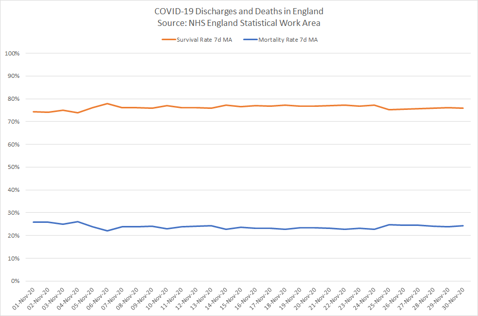

# COVID-19 

## Facts for England - November 2020

This thread considers the headline COVID-19 figures (hospitalisations and deaths) in the context of community prevalence.

It also covers "died with COVID, not of COVID" and the plausibility of high "false positives" rates from PCR testing.

Needs to be considered as a whole!

### 1. Prevalence

~1.4% of the population were testing positive for COVID-19 during mid-Nov and under 1% in the over 70s.

This was established from >300,000 ONS and REACT-1 swab tests.

This is corroborated by ZOE (COVID symptom study), reporting symptomatic cases in ~1% of the UK population.

Links

- [Coronavirus (COVID-19) Infection Survey](https://www.ons.gov.uk/peoplepopulationandcommunity/healthandsocialcare/conditionsanddiseases/bulletins/coronaviruscovid19infectionsurveypilot/18december2020) - 18 December 2020
- [REACT-1 round 7 updated report](https://spiral.imperial.ac.uk/handle/10044/1/84879) - 15 December 2020
- [ZOE evolution of the infection across the UK](https://covid.joinzoe.com/data) - 18 December 2020

### 2. Hospital Admissions

~79,000 of ~89,000 G&A beds in England were occupied during November, ~14,300 patients with COVID-19.

This equated to 18% of the bed patients having COVID-19; 13 times the community prevalence.

Only 1.4% of non-COVID patients should have tested positive by chance!

Links

- [Urgent and Emergency Care Daily Situation Reports](https://www.england.nhs.uk/statistics/statistical-work-areas/uec-sitrep/) on NHS statistical work area
- [GOV.UK Coronavirus (COVID-19) in England](https://coronavirus.data.gov.uk/details/healthcare?areaType=nation&areaName=England)

### 3. Hospital Mortality Rates

Annually ~3% of hospital patients die whilst in hospital or within 30 days of discharge.

Contrast the ~24% of COVID-19 patients who died in November; 8 times higher than the usual 3%.

24% can't be created artificially, even by classifying every non-COVID death as COVID-19!

Links

- [Summary Hospital-level Mortality Indicator (SHMI)](https://digital.nhs.uk/data-and-information/publications/statistical/shmi/2020-05/shmi-january-2019---december-2019) - Deaths associated with hospitalisation, England
- [COVID-19 Daily Deaths](https://www.england.nhs.uk/statistics/statistical-work-areas/covid-19-daily-deaths/) - Total Announced Deaths
- [COVID-19 Hospital Activity](https://www.england.nhs.uk/statistics/statistical-work-areas/covid-19-hospital-activity/) - Daily Admissions and Beds

### 4. Weekly Deaths

One might have expected ~1.4% of non-COVID deaths to test positive by chance.

22% of the weekly deaths were reported as COVID-19; ~95% were within 28d of a positive test.

This was 15 times higher than chance, suggesting "died with COVID, not of COVID" was at most 1 in 15.

Links

- [Deaths registered weekly in England and Wales](https://www.ons.gov.uk/peoplepopulationandcommunity/birthsdeathsandmarriages/deaths/bulletins/deathsregisteredweeklyinenglandandwalesprovisional/previousReleases)

### 5. PCR Testing

The ONS and REACT-1 studies reported 62 of 186,662 swabs being positive in July; 0.03%.

This suggests that PCR results do not have an inherently high false-positive rate.

Lab contamination / false positives (despite being possible) cannot explain the stark hospital figures.

Links

- [Coronavirus (COVID-19) Infection Survey](https://www.ons.gov.uk/peoplepopulationandcommunity/healthandsocialcare/conditionsanddiseases/bulletins/coronaviruscovid19infectionsurveypilot/england9july2020) - England, 9 July 2020
- [REACT study](https://www.imperial.ac.uk/news/203873/largest-covid19-testing-study-shows-cases/) - 24th July to 11th August

### 6. Summary

I have compared hospital stats and weekly deaths against community prevalence of COVID-19.

It is very significant that COVID-19 patients are 8 times more likely to die than other patients.

Positive PCR results are a strong predictor of mortality which is beyond coincidence.

### 7. Conclusions

Daily figures from NHS and PHE may not be perfect but they do facilitate COVID-19 surveillance.

Claims about widespread false positives and "died with COVID" do not stack up.

Neither the hospital admission rates nor the high mortality rates can be explained by either claim.

