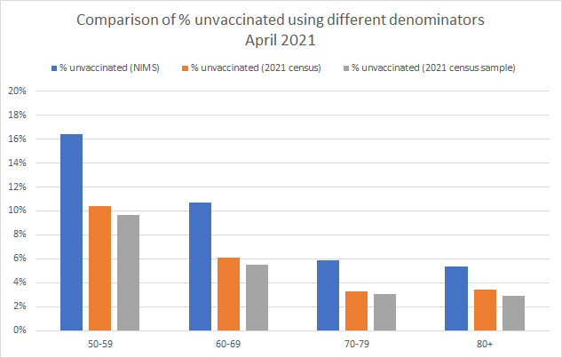

## Population Size - NIMS or ONS?

### Background

Ever since the launch of the National Immunisation Management System (NIMS), it has provided much higher population estimates for England, compared to official estimates from the Office for National Statistics (ONS). In our everyday lives such a discrepancy is of little / no consequence but when it comes to the communication and interpretation of COVID-19 vaccination statistics, it can (and does) lead to completely different conclusions.

To summarise the problem, we have no real way to accurately determine the total number of people who are unvaccinated in England. An accurate figure is available for the number of people who have received a vaccination, but calculating the number of unvaccinated persons requires an accurate estimate of the population size. In age groups with high vaccination rates, any differences in population estimates have a huge impact.

In essence, if a population estimate uses NIMS as its population estimate then the number of (allegedly) unvaccinated persons pretty much doubles for several age groups. This means that mortality rates calculated based on the "unvaccinated" population size are therefore halved. This is obviously a hugely significant issue when calculating and sharing vaccine statistics, so the big question is which source is best; NIMS or the ONS?

### Population Structure

The image below shows the population structure according to the ONS census in March 2021. Every year some people born, some people die (mainly the elderly) and everyone moves to the right by one place. It should also be noted how there is a spike in the 73 and 74 year olds. Depending on when data is analysed this can have a big impact on the 70-74 and 75-79 year old age groups, especially in 2022 and 2023.

This chart will be the only one in this article showing a breakdown by single year of age. All other graphs will use age ranges, typically of 5 or 10 years. However, I thought it useful so that readers can appreciate the variability across the various ages. These variations can have quite a significant impact on the number of people in each of the 5 year age groups over time.

### Population Estimates

Let's start by looking at a chart showing the estimated adult population of England, but according to both NIMS and the ONS. The chart is showing figures for all adults alive on 30 June 2021, since that is the date of the 2021 mid-year estimate from the ONS.

It is clear that NIMS is reporting far more adults living in England than the ONS. The totals are 49,387,600 (NIMS) and 44,774,763 (ONS) which means that NIMS thinks there are around 4.6 million adults more than the ONS. This equates to the NIMS figure being 10% higher than the ONS figure.

So, why is the difference so important?

### Vaccinated or Unvaccinated?

It is possible to combine the vaccination figures from NIMS with the population estimates from NIMS and the ONS to show the percentage of the population who have been vaccinated. It's clear that the older age groups have the highest vaccination rates and that NIMS estimates results in lower vaccination rates than the ONS estimates.

A similar graph can also be created for unvaccinated persons, simply by subtracting the number of vaccinated persons from the population estimates.

The chart above should make it clear why the source of population estimates is so important in any analysis relating to vaccination status. If the NIMS population estimate is accurate, then any analysis relating to mortality rates should use the NIMS denominator, otherwise mortality rates will be doubled. If the ONS population estimate is accurate, then any analysis relating to mortality rates should use the ONS denominator, otherwise mortality rates will be halved.

So, which population estimate (aka denominator) is the most accurate / correct? What do we know about the provenance of these two datasets?

### Analysis during 2021

What started this whole debate was when COVID-19 vaccination figures were first published by NHS England in 2021. The figures were coming out of the National Immunisation Management System (NIMS) and people were trying to determine how many people were yet to be vaccinated.

At that time, the latest mid-year ONS population estimates were for 30 June 2019. Estimating the number of unvaccinated persons in 2021, but using population estimates from 2019 led to some odd looking figures. 60-64 was practically zero and 75-79 was negative!

This caused people to question the validity of ONS population estimates but in fairness, why would population estimates for 2019 be expected to apply to the 2021 population? The population structure by single year of age (shown earlier) clearly shows the large variability across the age groups.

There wasn't a release of mid-year estimates for 2020 in the summer of 2021 because the census activities were taking priority. The mid-year population estimates for 2020 were finally released in early 2022 and somewhat improved the chart for June 2021.

Finally, actual mid-year estimates for 2021 were released in December 2022 and the chart looked to make even more sense:

Arguably there is still something slightly off in the 70-74 age group but that may be related to another data nuance, within the NIMS data itself.

Prior to October 2021 all of the the data originating from NIMS used ages as they were on 31 March 2021. In other words, even the chart above (which uses the appropriate ONS denominator) was based on peoples ages as-of 31 March 2021, 3 months prior to the vaccinations reported.

Anyhow, I think that probably summarises why people doubted the ONS population estimates back in 2021. The simple explanation is the population estimates for 2021 were not available at the time and 2019 population estimates were not appropriate.

### Census and Mid-Year Estimates

The ONS undertake a census, once every 10 years. This provides the most accurate estimate that we can possibly get of the population. Whilst it is recognised that some returns will be incorrect and some people will not complete the census (aka non-returns), this can be handled statistically.

When a small percentage of households do not complete their returns, [imputation](https://en.wikipedia.org/wiki/Imputation_(statistics)) creates statistically representative data using comparable households. It's a robust statistical method and means that despite a response rate which is not 100%, accurate population estimates can still be derived.

The response rate for the 2021 census was particularly good; 97% of all households and all individuals which was better than the official targets and the previous census in 2011. Perhaps the high response rate was in part due to it also being the first digital census in England and Wales.

A summary of the 2021 [census data](https://www.ons.gov.uk/peoplepopulationandcommunity/populationandmigration/populationestimates/bulletins/populationandhouseholdestimatesenglandandwales/census2021unroundeddata#measuring-the-data) is available and there is also a bulletin describing how the ONS have maximised [data quality](https://www.ons.gov.uk/peoplepopulationandcommunity/populationandmigration/populationestimates/methodologies/maximisingthequalityofcensus2021populationestimates) of the 2021 census.

A couple of key points:

- 97% response rate, both at an individual and household level
- Accuracy of +/- 0.2 % (95% CI)

Total adult population for England was reported to be 44.7 million which is a lot less than the 49.4 million in NIMS around the same time.

During the 9 years prior to the next census, mid-year population estimates are produced using birth and death registrations and migration estimates, which are acquired from a variety of sources. The image below shows census figures a mid-year estimates dating back to the 1971 census.

Note that these figures show the total population, including persons under the age of 18.

### National Immunisation Management System (NIMS)

#### NIMS and the Personal Demographics Service (PDS)

NHS England commissioned the NHS South, Central and West CSU (which is part of NHS England) to implement a National Immunisation Management Service (NIMS). The implementation of NIMS delivers a centralised service for the management of seasonal flu immunisation and clinical cohorts as part of the call / recall service for COVID vaccinations

NIMS initially received a bulk extract of basic contact details (not medical history) and demographical data from the PDS. Since the initial bulk load, NIMS has been receiving daily updates from the PDS. The list of patients is restricted to people believed to be living in England and where the PDS does not have them flagged as deceased.

I have written a detailed [article](provenance.md) looking at the provenance of population data in NIMS. Feel free to read it if you wish but it can be summarised as follows:

The "national citizen list" in NIMS originates from the Personal Demographics Service (PDS). In the context of NIMS the PDS is a list of all patients ever registered with a GP practice in England since 1991, or ever treated by a health or care organisation who are still thought to be alive. Any data quality issues present in the PDS can and will propagate directly into NIMS, so NIMS is prone to duplicate records, deceased patient records, and patients who have emigrated but where the NHS is unaware.

The PDS explicitly states that it is not a population database:

Note how the initial load consisted of 73 million records for the 50 million people living in England, approximately 3 million in Wales and then a mix of people from other countries, duplicates, deceased and persons who had emigrated.

Additional information on the NHS Digital [website](https://digital.nhs.uk/developer/api-catalogue/personal-demographics-service-fhir#api-description__overview) is also pertinent:

The patient lists from the PDS flow straight into NIMS so any data quality issues in the PDS will also be present in the NIMS database. The National Back Office (NBO) are responsible for the data in the PDS and the challenges they face should not be underestimated. Ghost records can and do occur in the system and I have discussed them in more detail in a separate [article](provenance.md) that I wrote regarding the data provenance..

### Quick Review

I have yet to see a genuine explanation as to why some people believe NIMS is appropriate for population estimates. Points to consider:

- 97% of all households and individuals completed the census.

- The other 3% of households are easily identifiable via sources such as Post Office Address File (PAF).

- The census estimated the adult population in England at 44.7 million +/- 0.2%, so between 44.6 and 44.8 million, included imputed persons.

- NIMS receives a list of persons from PDS. The PDS list includes everyone ever registered with the NHS in England, if thought to be living.

- NIMS had an adult population of 49.4 million around the time of the census. This is 10% higher than the adult population determined by the census.

- How could the ONS have "missed" slightly over 10% of all adults living in England, given such a high response rate and +/- 0.2% accuracy?

- The census imputed persons for the 3% of households that did not complete a census return and they are included in the population estimates.

So, now let's look at a bit more real data relating to the census and NIMS.

### Population Sampling

The ONS neatly sidestep the issues caused by unknown denominators, using a very large sample from the 2021 census. This allows people to be linked to their NHS records and then compared to each other based on demographics, vaccination status, etc.

I wrote another [article](../deaths-by-vax-status/README.md) about how that linking process works, slightly over a week ago. Feel free to check it out.

#### Representative Samples?

In relation to the sampling, I have considered a number of ways to assess how representative the samples are of the overall population in the census One quick way is to look at what percentage of the population have been vaccinated (or unvaccinated) using the ONS population estimate, NIMS population estimate and in the actual samples.

The following chart shows this information for the vaccinated population, shortly after the 2021 census:

A similar chart is also possible for the unvaccinated population:

It should be noted that there a few small nuances to this dataset:

- The NIMS data came from a weekly NHS vaccination report, published in early April 2021
  - This data only detailed the adult age groups of 50 and above, hence why only 4 groups are shown.
- The NIMS figures are based on ages as of 31 March 2021
- The ONS census data is based on ages as of 21 March 2021

Putting these nuances aside it it quite noticeable that the vaccinated and unvaccinated proportions are strikingly in the sample and the full census population. This is suggestive that the sample is representative of the whole population, although obviously not firm proof.

The NIMS proportions are quite different though, showing a significantly higher percentage of unvaccinated persons. This tells us that there is a significant difference between the NIMS population and persons in the census who can be linked to their NHS number.

#### Additional Comparisons

Ideally, I'd have done similar comparisons for additional months and additional age groups, but this is not possible due to nuances in the NIMS data.

- Calculation of ages:
  - Prior to 28 Oct 2021, ages were based on a fixed date - 31 Mar 2021
  - Prior to 12 April 2022, ages were based on a fixed date - 31 Aug 2021
  - Since 12 April 2022, vaccination statistics have been based on the current age
- Limited dates for ONS population estimates. Two datasets from 2021 are available but nothing for 2022, yet:
  - Census on 21 March 2021
  - Mid-year estimate on 30 June 2021

I'd considered attempting to process the following dates but they all have their own issues:

- 30 June 2021, date of the ONS mid-year estimate
  - NIMS data uses dates of births as-of 31 March 2021, so 3 months out of date.
- 21 Mar 2022 (or early April), first anniversary of the census
  - This involves "ageing" the census by a year. Applying deaths and ageing the survivors is easy but handling net migration is not straightforward.
  - Prior to 12 April 2022, NIMS supplied dates of births as-of 31 Aug 2021, so 7.5 months out of date.
- 30 June 2022, anniversary of the ONS mid-year estimate
  - This involves aging the 2021 mid-year estimate by a year. Handling net migration is not straightforward.
- 21 Mar 2023 (or early April), second anniversary of the census
  - This involves "ageing" the census by 2 years. Applying deaths and ageing the survivors is easy but handling net migration is not straightforward.

The next real opportunity to perform this analysis will be when the mid-year estimate for 2022 is released by the ONS, some time in the summer of 2023.

### NIMS Curiosity

When using NIMS data alone, calculating the percentage of the population that is unvaccinated produces the following chart.

It is curious that the 18-24 year olds seem to have a higher vaccination rate than the 25-29 and 30-34 year olds?

Is this really true or is it more likely to be an artefact of the NIMS data over-estimating the 18-24 population?

### Wrap Up

NIMS should not be regarded as a population database. The PDS which feeds NIMS has explicitly stated that it is not a population database and contains a record for everyone who has ever been registered with the NHS, since 1991. The purpose of the PDS is primarily to identify patients, looking them up by name / address / postcode / dob, etc. It was never designed to be a population database but it does feed NIMS.

The PDS and NIMS contain demographic information for everyone known to the NHS, thought to be resident in England. NIMS receives daily updates from the PDS and will be subject to the same data quality issues as the PDS itself; e.g. duplicate NHS numbers, confused records, incorrect demographic data, incorrectly set death status and people who have emigrated but their departure is unknown to the NHS.

It seems implausible that such a system would ever be more accurate than a census which is carefully designed to produce the most accurate information at a population level. The census 2021 response rate was higher than ever, 97% (households and individuals) and the remaining 3% were imputed using proven statistical methods. How could it have missed a further 10% of the population? Is there any actual evidence?

The reason that the ONS population estimates were originally doubted was use of 2019 population estimates with 2021 vaccination data. There are no such discrepancies when using the 2021 population estimate, based on the census three months prior. Creating a linked dataset using the 2021 census also appears to have produced samples likely to be representative of the total census population and a good foundation for further analysis.

There is a curious artefact in the NIMS data that appears to show higher vaccination rates for 18-24 year olds, compared to 25-29 and 30-34 years olds. Why is that? It's clearly not impossible that the 18-24 have higher vaccination rates but is it plausible or is it due to the NIMS denominator?

Neither NIMS, nor the PDS were created for estimating the population size and they should not be used for that purpose.

Without exception, every substack article and viral chart either suggesting or claiming "vaccine harms" utilizes the NIMS denominators within their inner workings. Without that denominator the charts would tell a different story. When you see a chart, consider how the denominator was chosen and why!

TLDR - There is no excuse for using NIMS to calculate unvaccinated population estimates. Doing so is entirely inappropriate!
