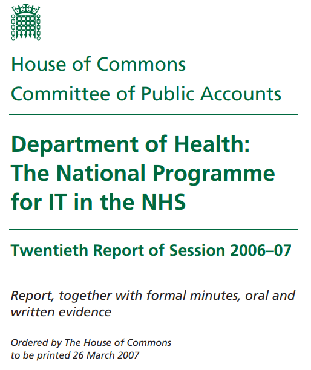
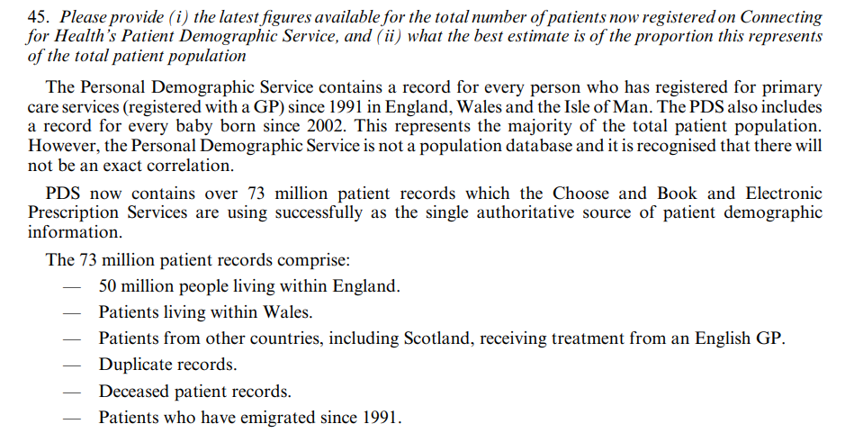
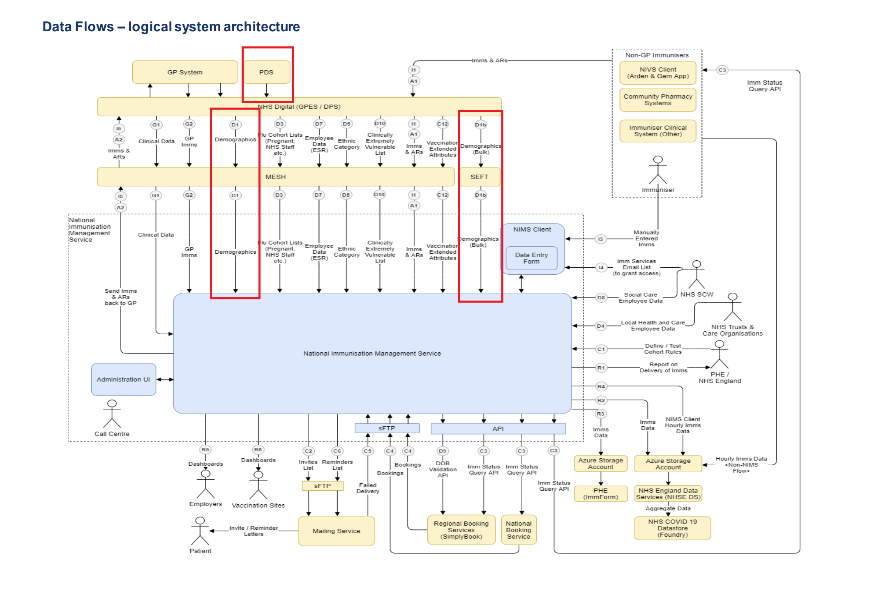

## National Immunisation Management System (NIMS) and the PDS

### Background

This article is a collation of the various resources that I read to gain an understanding of where NIMS gets its population data and what the data represents. The article links to more content than I really wanted to know about the NHS systems, but the sources did prove invaluable in understanding how NIMS has acquired its population data. All of the content is publicly available and was easy to find via Google.

The NHS consists of over 27,000 individual organisations (e.g., primary and secondary care sites, pharmacies, opticians, dentists), so a standardised system for transferring information is seen as essential. The NHS spine is the name given by the NHS to a collection of local and national databases and systems containing both patient's clinical and demographic information. The spine was developed and is maintained by NHS Digital.

The spine connects a wide range of systems, including the Personal Demographics Service (PDS) – a database storing NHS Number and patient demographic information. Regardless of nationality, or where they live now, the PDS includes all patients who have ever been registered with a GP practice, or treated by an NHS health or care organisation (even as a visitor or migrant). The PDS database contains patient details going back to 1991.

The PDS provides a list of all patients eligible for vaccination to NIMS. NIMS contains all of the patients from the PDS; i.e. all patients ever registered with a GP practice, or ever treated by a health or care organisation. Data quality issues in the PDS will propagate directly into NIMS, so it will also include a significant number of duplicate records, deceased patient records, and patients who have emigrated since 1991.

Before going into greater detail about NIMS, the spine, or the PDS, it is perhaps worth summarising the history of the NHS master database.

### History

#### National Health Service Central Register (NHSCR)

Until 1991 the NHSCR was managed as a paper based system. NHS Numbers, along with patient demographic and status information was organised in transcript books (indexed by NHSID) with a unique entry for each person. Each transcript book held registrations for one registration area for a specific time period.

#### NHSCR and Central Health Register Enquiry System (CHRIS)

In 1991, NHSCR introduced an in-house developed computer system known as CHRIS (Central Health Register Enquiry System). The CHRIS system (which went live on the 1st January 1991) was populated with the digitised records of all the live patients recorded in the NHSCR register. It was subsequently updated with the records of new born babies and patients immigrating into England, Wales and Isle of Man who then registered with a GP. The CHRIS system was replaced by the Personal Demographics Service (PDS) as part of the NHS spine program.

#### The NHS Spine

The NHS spine connects a wide range of systems, including the Personal Demographics Service (PDS). The spine and the PDS went live in June 2004.

#### Personal Demographics Service (PDS) and the National Back Office (NBO)

The Personal Demographics Service (PDS) replaced the NHSCR and is now the national electronic database of patient demographic details (i.e. the master patient register). It contains patient identifiers including the NHS Number, name, address, date of birth and associated nonclinical medical information such as their General Practice registration details.

The PDS and the National Back Office (NBO) share responsibility for managing the NHS Number and the associated patient demographic data held within the PDS database. The PDS role relates to allocating NHS Numbers. It is within the NBO remit to manage the quality of NHS Numbers through identifying problem records (e.g. duplicate records) and reconciling problems with incoming data feeds.

#### National Immunisation Management System (NIMS)

NHS England commissioned the NHS South, Central and West CSU (which is part of NHS England) to implement a National Immunisation Management Service (NIMS). The implementation of NIMS delivers a centralised service for the management of seasonal flu immunisation and clinical cohorts as part of the call / recall service for COVID vaccinations

NIMS initially received a bulk extract of patient details and demographical data from the PDS. Since the initial bulk load, NIMS has been receiving daily updates from the PDS. The list of patients is restricted to people believed to be living in England and where PDS does not have them flagged as deceased.

### Spine and the Personal Demographics Service (PDS)

#### Summary

Spine and the Personal Demographics Service (PDS) went live in June 2004. Details of the National Programme for IT in the NHS can be found on the parliament.uk website:

The documentation from 2006/2007 provides some useful insights into the Personal Demographics Service (PDS):

> The Personal Demographic Service contains a record for every person who has registered for primary care services (registered with a GP) since 1991 in England, Wales and the Isle of Man. The PDS also includes a record for every baby born since 2002. This represents the majority of the total patient population.
> 
> However, the Personal Demographic Service is not a population database and it is recognised that there will not be an exact correlation.
> 
> PDS now contains over 73 million patient records. The 73 million patient records comprise:
> 
> - 50 million people living within England.
> - Patients living within Wales.
> - Patients from other countries, including Scotland, receiving treatment from an English GP.
> - Duplicate records.
> - Deceased patient records.
> - Patients who have emigrated since 1991.

For completeness here is a screenshot where the two pages have been combined:

Note how the PDS contains a record for every person who has ever registered for primary care services (i.e. registered with a GP) since 1991. The statement also says "the Personal Demographic Service is not a population database" and lists several reasons why it contains 23 million people more than the 50 million population of England; including duplicate records, deceased patients and patients who have emigrated.

Basic information about the PDS and its role in the spine can be found in the full document produced for the parliamentary select committee:

- [Select Committee on Public Accounts - Minutes of Evidence](https://publications.parliament.uk/pa/cm200607/cmselect/cmpubacc/390/6062629.htm)
  - [Department of Health: The National Programme for IT in the NHS - Twentieth Report of Session 2006–07](https://publications.parliament.uk/pa/cm200607/cmselect/cmpubacc/390/390.pdf)

- Tip: search for for "emigrated" or "demographic" in the above links.

A basic overview of the PDS can also be found in a document from 2007:

- [Personal Demographics Service (PDS) A guide for general practice](https://www.mysurgerywebsite.co.uk/website/IGP367/files/gppdsguidev2.pdf)
  - "The PDS will gradually integrate and replace several existing NHS demographic databases, including the NHS Central Register (NHSCR). This document was created in 2007 and this has now happened."

#### Patients Included in the PDS

To quote the current NHS Digital [website](https://digital.nhs.uk/developer/api-catalogue/personal-demographics-service-fhir#api-description__overview) (Mar 2022) - section "Patients included in PDS":

> Regardless of nationality, or where they live now, PDS includes all patients who have ever been registered with a GP practice, or treated by a health or care organisation (even as a visitor or migrant) in England, Wales, the Isle of Man, or in a UK Defence Medical Services unit anywhere in the world.
> 
>All patients in PDS have an NHS number which is unique. The 10-digit NHS number is used in England, Wales, the Isle of Man, Scotland and Northern Ireland, but not the Channel Islands. Scotland and Northern Ireland have their own distinct number ranges.

Just for completeness, here is a screenshot of the webpage as well:

This statement makes it very clear that the PDS includes all patients who have ever been registered with a GP practice, or been treated by a health or care organisation, regardless of nationality, or where they live now. It also begs the question, how do the the National Back Office (NBO) ensure that it reflects the true population and how do they handle emigration?

#### Further Information

Various links which provide some further background relating to the PDS and data quality:

- [Personal Demographics Service](https://digital.nhs.uk/services/demographics#the-personal-demographics-service)
- [Data Quality Incidents](https://digital.nhs.uk/services/national-back-office-for-the-personal-demographics-service/data-quality-incidents)
- [Allocation of NHS numbers](https://digital.nhs.uk/services/national-back-office-for-the-personal-demographics-service/management-of-nhs-numbers-and-pds-records#nhs-number-allocations)
- [Fair Use Policy](https://digital.nhs.uk/services/demographics/personal-demographics-service-fair-processing#level-of-data)

The following document is also useful for understanding the history of NHS systems and what is stored in the PDS:

- [NHS Numbers and their management systems](https://www.closer.ac.uk/wp-content/uploads/CLOSER-resource-NHS-Numbers-and-their-management-systems.pdf) by Andy Boyd, Richard Thomas, John Macleod
  - This also shows that main, temporary and correspondence addresses are being stored in the PDS

People who wish to see details of the API and how it can be searched:

- Look at the developer [documentation](https://digital.nhs.uk/developer/api-catalogue/personal-demographics-service-fhir#api-Default-search-patient).
  - e.g. It is possible to search for a patient using their given name, family name, postcode and date of birth.

### NIMS

Now that the PDS has been described at length, it can be considered within the context of NIMS.

A good overview of NIMS can be found in the [Data Protection Impact Assessment](https://www.england.nhs.uk/publication/data-protection-impact-assessment-national-flu-and-covid-19-vaccination-programme-including-the-national-immunisation-management-service-nims/). It includes a logical system architecture of all of the data flows (shown below) and data feeds from the PDS are highlighted in red.

There was initially a bulk transfer from the PDS (D1b), followed by daily updates ever since (D1). A real-time feed / interface is also mentioned in the DPIA (D2) but it's not clear whether that has ever been implemented.

A few quotes from the DPIA confirm that the PDS is the source of the so-called "national citizen list" in NIMS:

> NIMS will be supported by an Immunisation Management System (IMS). This platform will integrate new instances of CarePlus and CareCentric. It will be populated initially with demographic data representing the population of England from the Personal Demographics Service which is processed by NHS Digital under Direction of the Department of Health and Social Care and NHS England. It will subsequently receive regular updates to ensure that the two systems remain synchronised.
>
> Loading the national citizen list. The Immunisation Management System (IMS) population list will be fed from the Spine Demographics Reporting Service (SDRS). This includes demographic details for every citizen. There will be an initial load of data and the system will then be connected to receive nightly spine updates.
>
> To this end the Immunisation Management System (IMS), the central database that supports the NIMS will be populated with demographic information from the Personal Demographics Service for everyone resident and registered with a GP in England.

To summarise, NIMS contains demographic information from the Personal Demographics Service (PDS) for everyone known to the NHS, thought to be resident in England. NIMS receives daily updates from the PDS and will be subject to the same data quality issues as the PDS itself; e.g. duplicate NHS Numbers, confused records, incorrect demographic data, incorrectly set death status and people who have emigrated but their departure is unknown to the NHS.

The following links may prove useful to anyone reading the DPIA and encountering unfamiliar acronyms representing NHS systems:

- [Improving our Data Processing Services (DPS)](https://digital.nhs.uk/data-and-information/data-insights-and-statistics/improving-our-data-processing-services)
- [Spine Mini Service Provider for Personal Demographics Service (SMSP)](https://digital.nhs.uk/services/spine/spine-mini-service-provider-for-personal-demographics-service)
- [General Practice Extraction Service (GPES)](https://digital.nhs.uk/services/general-practice-extraction-service)
- [Message Exchange for Social Care and Health (MESH)](https://digital.nhs.uk/services/message-exchange-for-social-care-and-health-mesh)
- [Secure Electronic File Transfer (SEFT)](https://digital.nhs.uk/services/transfer-data-securely)

#### Additional NIMS Insights

There is quite a lot to be gleaned about the data in and out of NIMS in the [Data Protection Impact Assessment](https://www.england.nhs.uk/publication/data-protection-impact-assessment-national-flu-and-covid-19-vaccination-programme-including-the-national-immunisation-management-service-nims/).

- Searching for "sdrs" and pds" shows the section(s) related to PDS data loaded into NIMS.
  - 24/08/2020 – initial SDRS feed (demographic data feed)
- Searching for "death" and " ons " shows the section(s) related to the ONS extract for the deaths by vaccination status.
  - TRE1: Trusted Research Environments (TREs). To make de-identified NIMS COVID-19 vaccination data available for scientific research and statistical analysis purposes through the ONS Secure Research Service (SRS) to Accredited Researchers including those working for the Accredited Projects of SPI-M members, AND To link the vaccination data to other data held by ONS.
- Searching for "phe" shows the section(s) related to the PHE extract for vaccine surveillance and dashboard reports.
  - PHE1: Public Health England (PHE) dataset. PHE monitoring of vaccine coverage, vaccine safety and vaccine failures vaccine effectiveness.

### PDS Data Quality

#### National Back Office (NBO) 

The National Back Office (NBO) provides a national data quality service.

The NBO is responsible for the management of NHS Numbers and PDS records, investigation and resolution of data quality incidents on Personal Demographics Service (PDS) demographic records, and the provision of a Tracing Service to approved organisations.

Examples of data quality incidents are described on the NBO [website](https://digital.nhs.uk/services/national-back-office-for-the-personal-demographics-service/data-quality-incidents). This page describes duplicate NHS Numbers, confused records, incorrect demographic data and incorrectly set death status.

#### Migration

Failure to remove emigrants from the Personal Demographics Service (PDS) is another way that "ghost" records can accumulate over time. Immediately after it's creation the PDS did not have duplicates and ghosts removed because CHRIS was still the master database. Nowadays the PDS is the master database and it is maintained by the NBO. The challenges faced by the NBO, relating to the data quality should not be underestimated.

Practice relating to permanent emigration has changed over time. Historically, permanent embarkation (emigration) was recorded as a result of patients handing in their ‘medical card’ at the point of emigration. The move away from using ‘medical cards’ has meant this practice no longer occurs and may as a result lead to some under-reporting of emigration.

In Northern Ireland, only an estimated three out of five patients leaving country to live abroad notify their family GP.

Note about medical cards from [NHS England](https://www.england.nhs.uk/contact-us/how-can-we-help/#how-do-i-get-a-medical-card):

> Medical cards are no longer issued in England. If you still have one it may have an old-style NHS Number made-up of both letters and numbers. However, in recent years this has been replaced for all patients with an NHS Number containing only numbers. For more information about the NHS number visit the NHS website.

#### Statement from the UKHSA

The UKHSA wrote an [blog](https://ukhsa.blog.gov.uk/2021/11/02/transparency-and-data-ukhsas-vaccines-report/) article about data transparency and touched on denominators. The article says the following about NIMS:

> The NHS national register (called NIMS) includes everyone who registered with the NHS and is therefore eligible to be called forward for a vaccine. Although NIMS is not perfect, it represents each unique individual who is being targeted for the vaccination programme and provides the only comparable information on key criteria for those who are targeted and those who are vaccinated. One of the basic problems with NIMS is that it contains some people who were registered with the NHS but may have moved – for example overseas – but these people have not yet been removed from the database – these are often called “ghosts”. Because vaccine uptake has been so high, even a small number of additional people included in the database will inflate the number recorded as unvaccinated – so this makes the rate of COVID-19 cases in some of the younger unvaccinated groups appear lower than it should be.

The UKHSA have specifically mentioned that one of the basic problems with NIMS is that it contains some people who were registered with the NHS but may have moved – for example overseas – but these people have not yet been removed from the database.

### Ages of Individuals

#### UKHSA Dashboard

It may be worth clarifying what the vaccination data available from the [UKHSA website](https://coronavirus.data.gov.uk/details/vaccinations?areaType=nation&areaName=England) actually represents.

The screen grab blow is showing that 13.9% of today's 80-84 year-olds received their first dose by 1 Jan 2021. It does NOT say that 13.9% of 80-84 years on 1 Jan 2021 had received their first dose. This data (even via the API) cannot be used directly to determine how many doses were administered to specific age groups for dates in the past, nor how many people were in the NIMS "national citizen list" for a specific age-group for dates in the past. *

Any analysis attempting to match historical vaccination rates with death registrations from an ONS dataset (e.g. deaths by vaccination status) could eaily be matching vaccination rates based on the people alive today to the deaths of others occurring in the past. Data from such analysis will likely be confusing and undoubtedly misleading.

\* It is possible to retrieve some historical / archive data using the [API](https://coronavirus.data.gov.uk/details/download) but caution is required prior to 22 April 2022. This is because of the way that ages were split into cohorts using fixed dates prior to that date, described below.

Documentation of the vaccination metrics is available on the UKHSA dashboard. For example:

- Cumulative people vaccinated 1st dose by vaccination date - [documentation](https://coronavirus.data.gov.uk/metrics/doc/cumPeopleVaccinatedFirstDoseByVaccinationDate).

It is important to note the way that ages have been calculated and how the definition has changed over time:

- Prior to 28 Oct 2021, ages were based on a fixed date - 31 Mar 2021 - see [change](https://coronavirus.data.gov.uk/details/whats-new/record/6dc2944a-b95f-4452-8f77-fdf14ae6bdde) documentation.
  - This nuance can have a significant impact, especially when analysing the data for highly the vaccinated age groups.
- Prior to 12 April 2022, ages were based on a fixed date - 31 Aug 2021 - see [change](https://coronavirus.data.gov.uk/details/whats-new/record/fbe151fe-6a28-4f86-940c-1369c2f4b4b1) documentation.
  - This nuance can have a significant impact, especially when analysing the data for highly the vaccinated age groups.
- Since 12 April 2022, vaccination statistics have been based on the current age - see [change](https://coronavirus.data.gov.uk/details/whats-new/record/fbe151fe-6a28-4f86-940c-1369c2f4b4b1) documentation.
  - This affects many metrics, including the size of the eligible population (according to NIMS), vaccination counts and rates.

#### NHS Extracts

The NHS [vaccine reports](https://www.england.nhs.uk/statistics/statistical-work-areas/covid-19-vaccinations/) (weekly and monthly) have also changed the way they have calculated ages, just like the UKHSA:

- Prior to late-Oct 2021, ages of individuals were based on age as-of 31 Mar 2021.
- Prior to mid-Apr 2022, ages of individuals were based on age as-of 31 Aug 2021.
- Since Apr 2022, ages of individuals have been based on age as-of the date of the data extract.

These nuances can have a significant impact, especially when analysing the data for highly the vaccinated age groups.

The cover sheets in a number of NHS spreadsheets said the following:

18 Nov 2021

> Prior to 21st October 2021 these publications reported the age of individuals based on age as at 31st March 2021.
>
> This publication is now reporting the age of individuals based on age as at 31st August 2021. 
>
> Please note that from 29th July 2021 the weekly publications have included a small number of vaccinations of English residents that occurred outside of England. Therefore the figures reported in recent publications will be slightly overestimated compared with previous publications.

17 March 2022

> The data in this release includes vaccinations given to individuals who have an NHS number and are currently alive.
>
> The age of individuals is based on age as at 31st August 2021. 

14 Apr 2022

> The data in this release includes vaccinations given to individuals who have an NHS number and are currently alive.
>
> The age of individuals is based on age as at date of data extract for breakdowns where UKHSA provide the data.

### Summary

Ok, that was a lot of stuff just about where the population data for NIMS originates and what it represents in the NHS reports and on the UKHSA dashboard. It is also important to take note of the age-related nuances in the vaccination data prior to mid-April 2022.

TLDR - The "national citizen list" in NIMS originates from the Personal Demographics Service (PDS) which is a list of all patients potentially eligible for vaccination. In the context of NIMS the PDS is a list of all patients ever registered with a GP practice in England, or ever treated by a health or care organisation who are still thought to be alive. Any data quality issues present in the PDS can and will propagate directly into NIMS, so NIMS is prone to duplicate records, deceased patient records, and patients who have emigrated.

NIMS is not the suitable for population estimates, but showing that with actual data is an entirely different article!