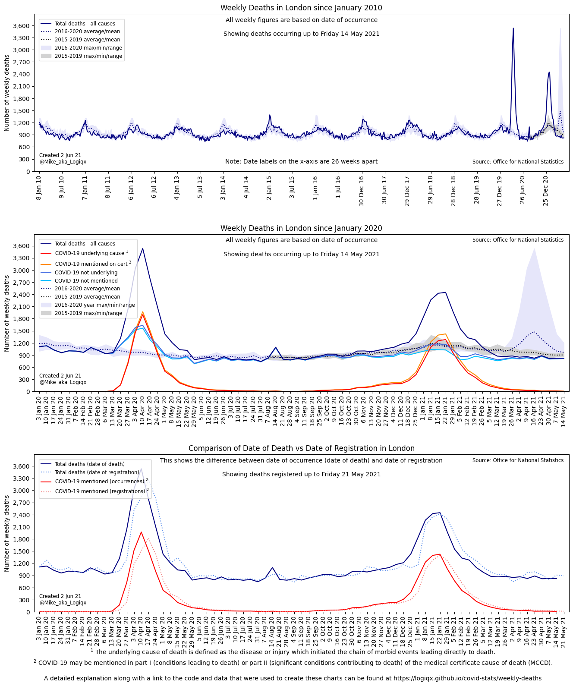
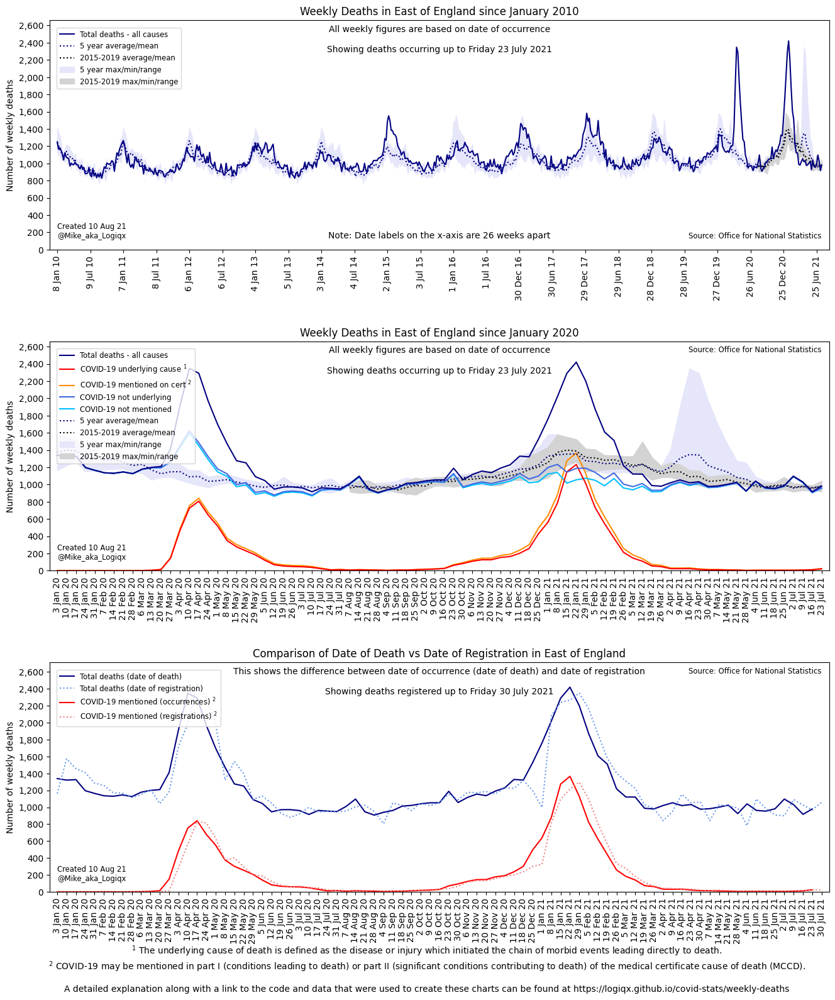
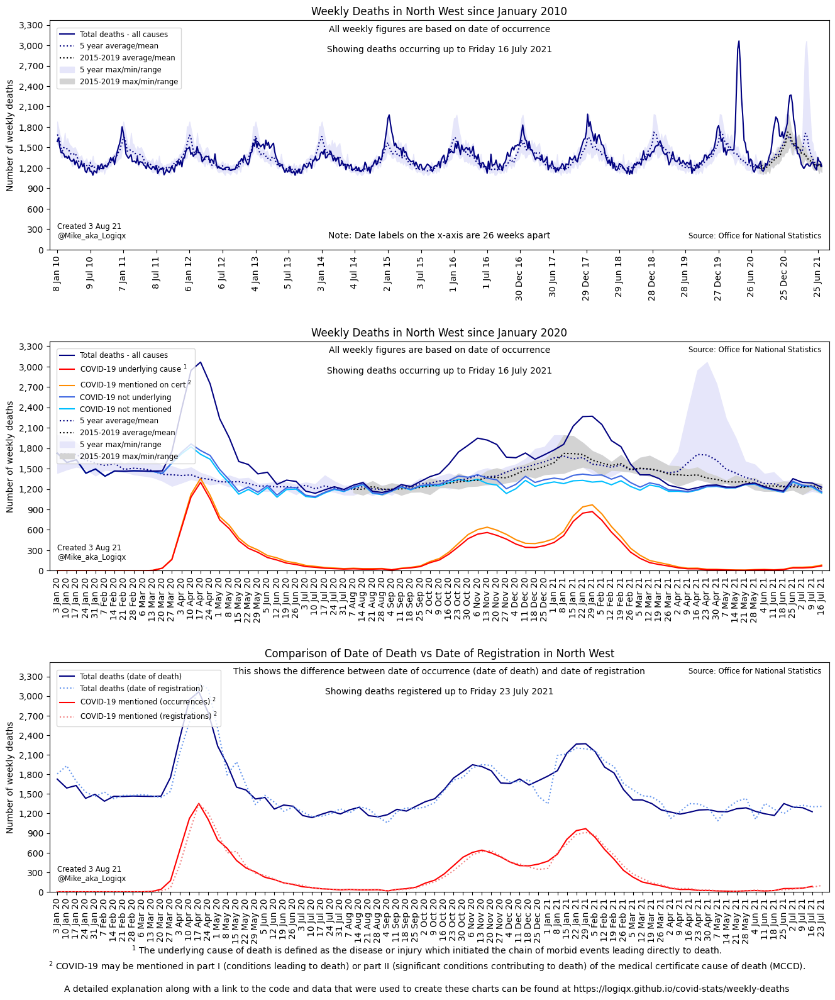
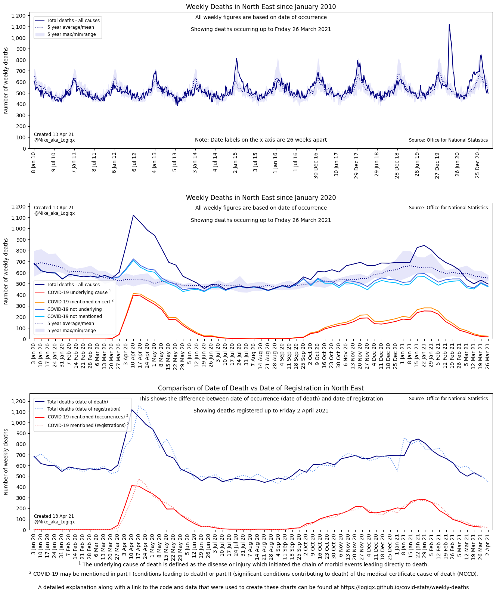
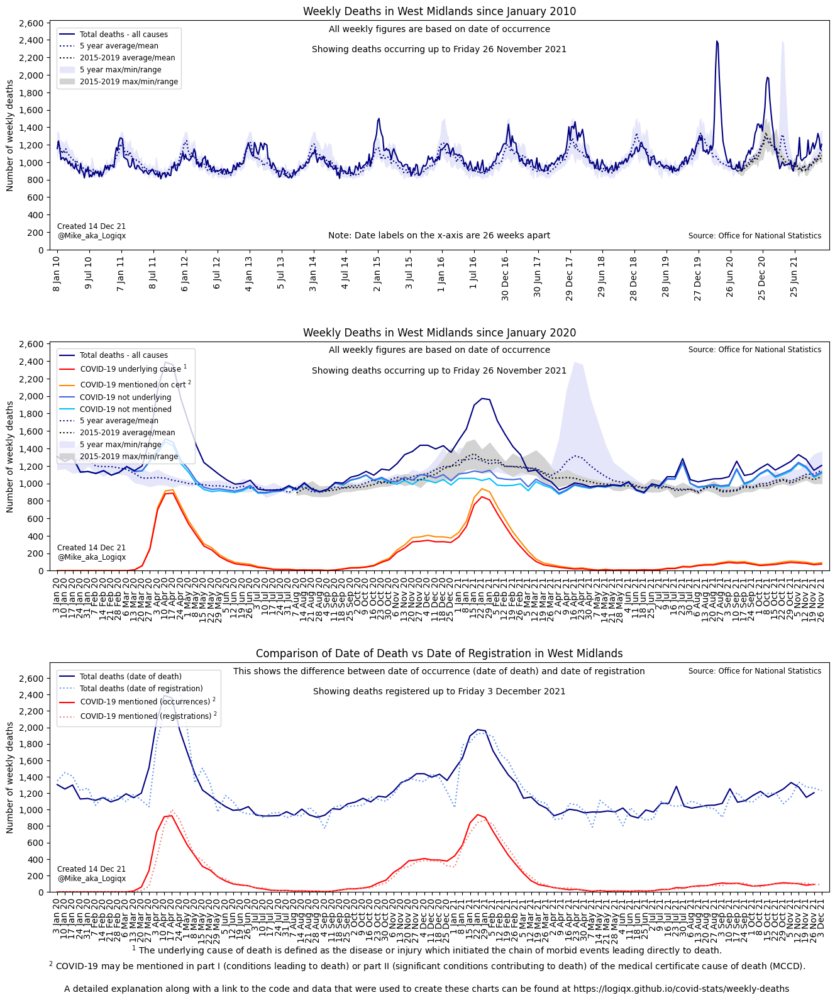
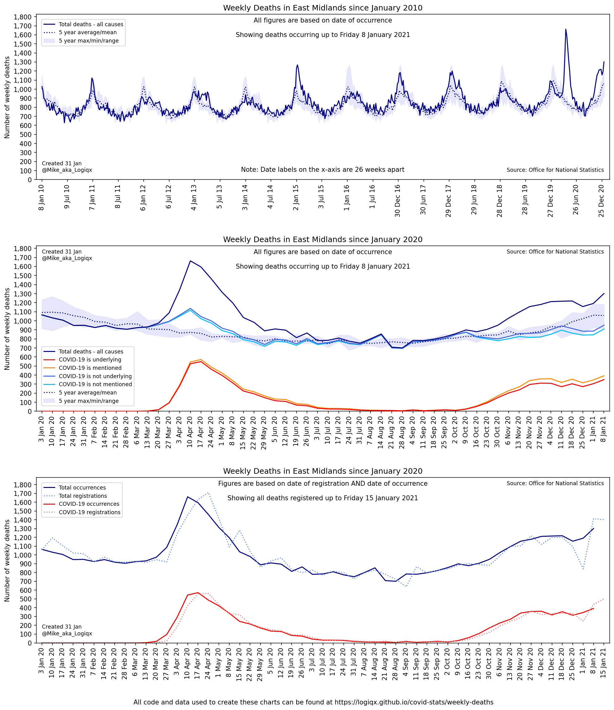
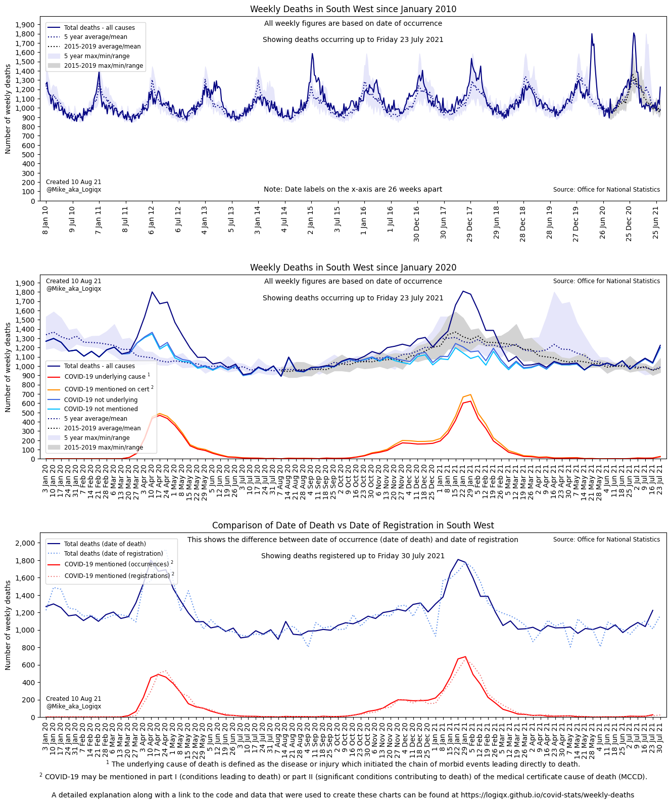
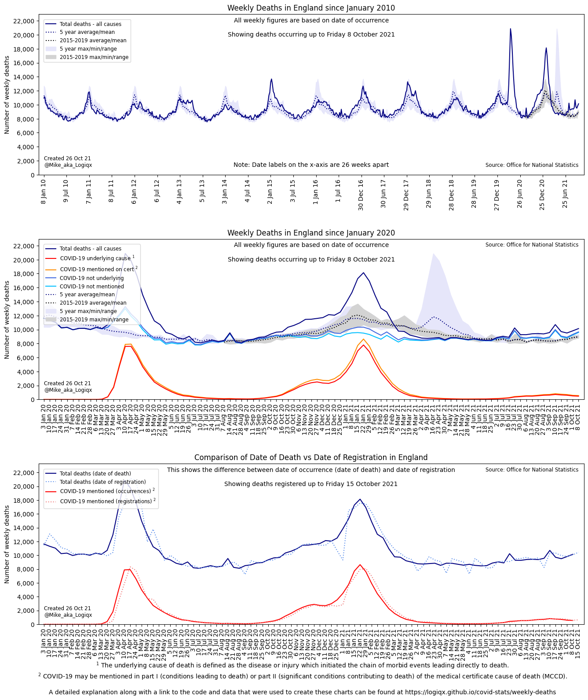
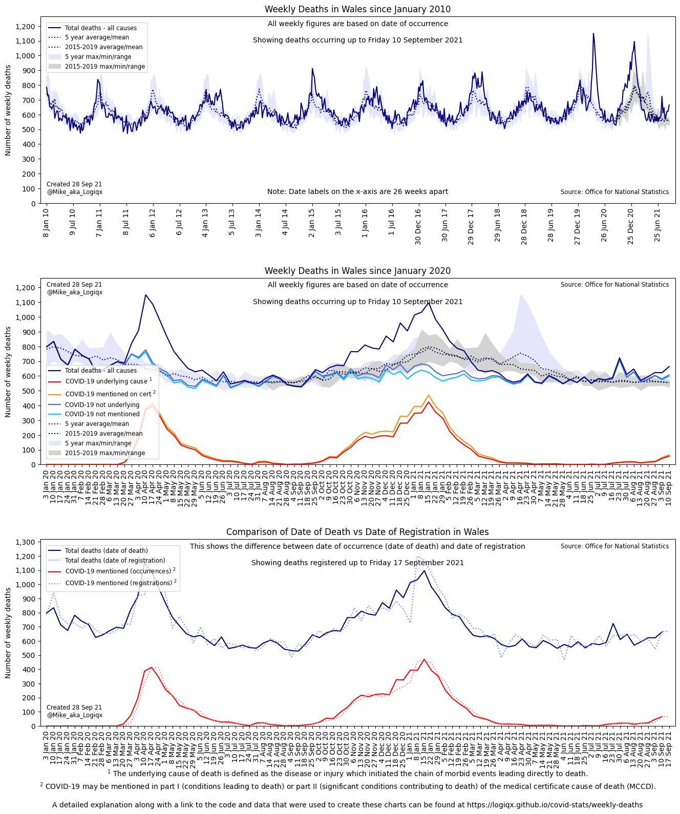

# Weekly Deaths in England and Wales

## Background

Delays in the death registration / reporting processes and the effects of bank holidays can make the interpretation of weekly data from the ONS somewhat tricky and prone to misinterpretation. The goal of these charts is to provide the clearest view possible of the weekly deaths reported by the ONS for England and Wales from 2010 onwards. These charts are based on the date of occurrence which makes interpretation much more straightforward but comparisons with weekly registrations are also provided.

## Technical Explanation

I am in the process of writing an explanation of how these charts were created.

- [Modelling of Regional Deaths by Date of Occurrence](../modelling-regional-occurrences/README.md) - early WIP and due to be written shortly so please ignore it for now!

## Project Code and Data

All of the project code and associated data is available in a Python project on [GitHub](https://github.com/Logiqx/covid-stats).

These are the most significant Python scripts:

- [ons_download.ipynb](https://github.com/Logiqx/covid-stats/blob/master/python/ons_download.ipynb) checks the ONS website for new weekly data and downloads the Excel spreadsheets.
- [ons_convert.ipynb](https://github.com/Logiqx/covid-stats/blob/master/python/ons_convert.ipynb) combines the data from all of the spreadsheets with historical extracts and saves them as CSV files.
- [ons_charts.ipynb](https://github.com/Logiqx/covid-stats/blob/master/python/ons_charts.ipynb) loads the CSV files into memory then calculates averages/maximums/minimums before plotting the charts.

A number of custom Python modules are also used which will become obvious when looking at the main scripts.

## Latest Charts

### London + East of England + South East

### North West + North East + Yorkshire and The Humber

### West Midlands + East Midlands + South West

### England and Wales + England + Wales

