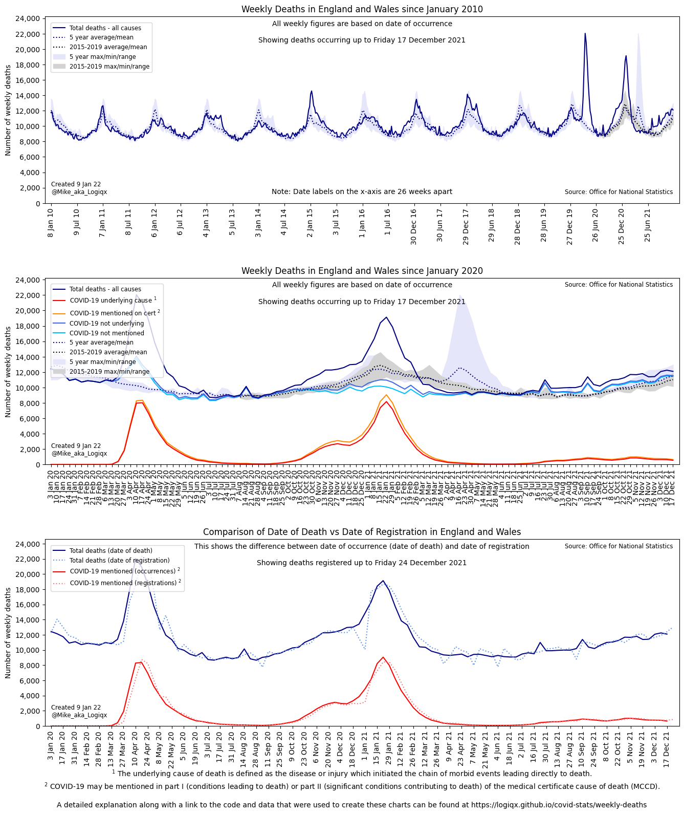
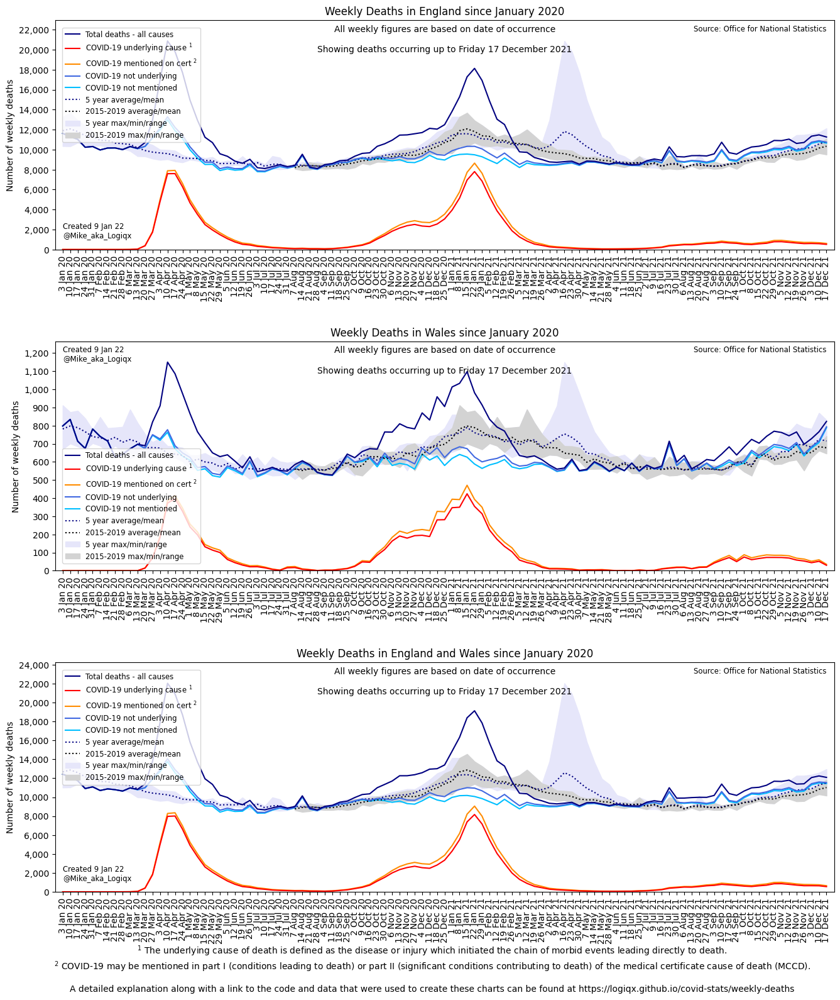
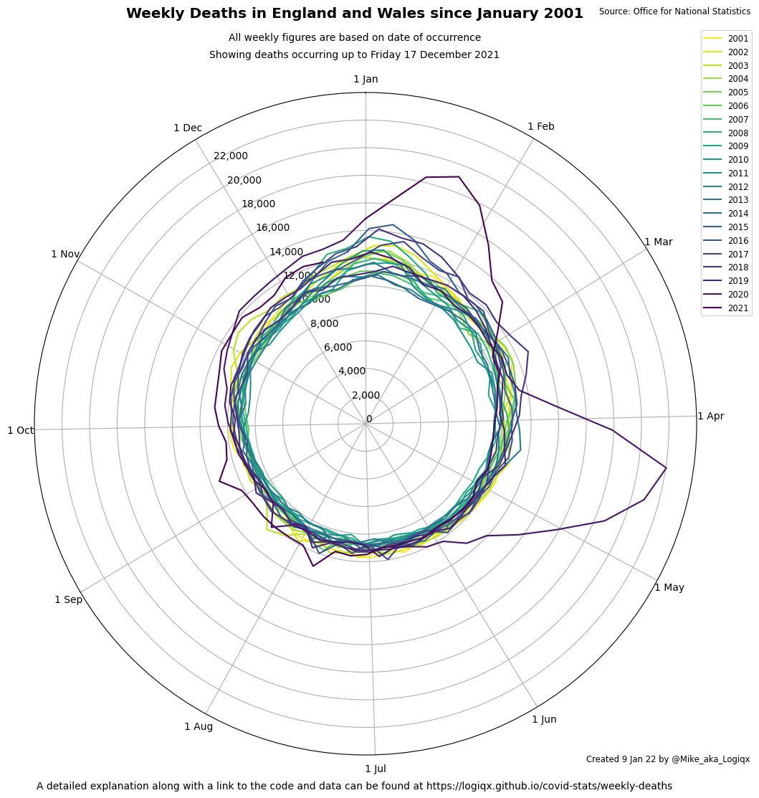

# Weekly Deaths in England and Wales

Author: Michael George

Created: 31 January 2021

Updated: 13 April 2021

## Background

Delays in the death registration / reporting processes and the effects of bank holidays can make the interpretation of weekly data from the ONS somewhat tricky and prone to misinterpretation.

The goal of these charts is to provide the clearest view possible of the weekly deaths reported by the ONS for England and Wales from 2010 onwards.

These charts are all based on the date of occurrence (date of death) which makes interpretation much more straightforward but comparisons of weekly registrations versus weekly occurrences are also provided.

## Technical Explanation

An explanation of the processing used for all 9 regions of England and Wales can be found in a separate article.

- [Estimating Regional Deaths by Date of Occurrence](../estimating-regional-occurrences/README.md)

All of the code and data used for this project are available on GitHub, accessible via the explanation article.

## Latest Charts

These charts will be posted as threads on Twitter with 3 images per tweet - e.g. London + South East + East of England.

### Individual Nations / Regions

There are multiple charts for each nation / region but they are all stored within a single image.

The charts for each nation / region can be viewed in a simple [gallery](regions.html).

### Combined Nations / Regions

These charts illustrate the close relationship between the rise in COVID-19 deaths and deaths from all causes. They compare against 5 year and 10 year baselines.

The charts for each nation / region can be viewed in a simple [gallery](regions_alt.html).

### Florence Nightingale Diagrams

These radar / polar charts are inspired by the diagrams of [Florence Nightgale](https://www.florence-nightingale.co.uk/coxcomb-diagram-1858/), showing the seasonality of weekly deaths and the impact of COVID-19.

The charts for each nation / region can be viewed in a simple [gallery](regions_polar.html).

